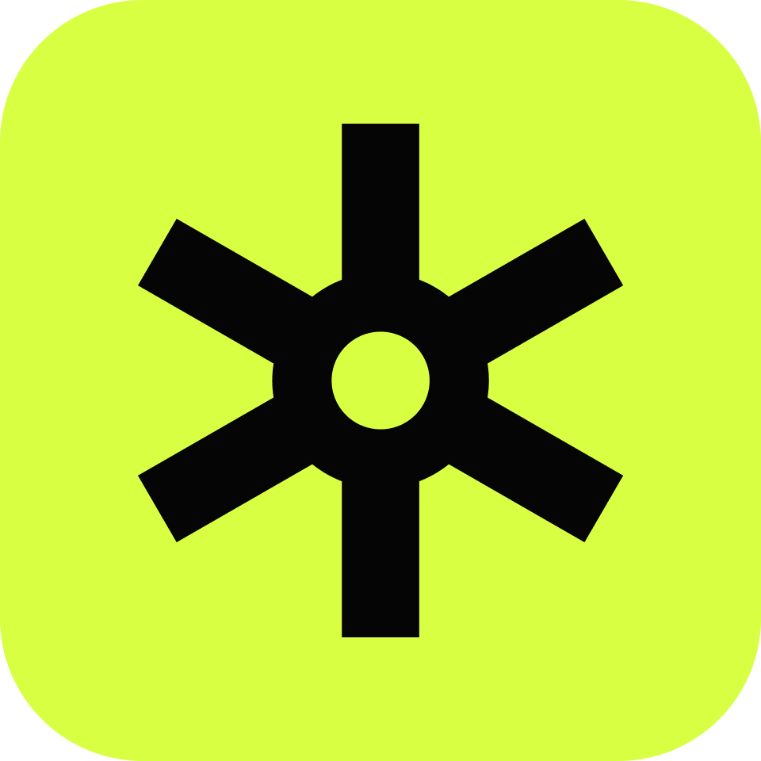

# 🎬 ZED ROS Wrapper: Replaying Data stored in SVO / Rosbag files

This tutorial details the use of the ZED SDK and ZED ROS2 wrapper to **record** and **replay** data offline with different files (SVO, Rosbag) and replay tools: 

- the __svo_control_node__: allows users to control the replay of an SVO launched with the ZED ROS wrapper. Users can pause/resume the rosbag, change the svo position manually forward or in reverse, increase/decrease the replay rate. 

- the __sync_node__: allows users to replay an SVO in the ZED ROS Wrapper and sync it with rosbag topics (limited at the moment to one rosbag topic of similar timerate like lidar data). Users can pause/resume the replay, and advance manually frame by frame while keeping topics synchronized. 

These tools can be used as part of debugging workflows, helping users optimize their robotics stack with ZED.

## ⚙️ **Installation**  

### **1️⃣ Install the ZED SDK and ROS 2 Wrapper**  

Ensure you have the latest [ZED SDK](https://www.stereolabs.com/en-fr/developers/release) downloaded and installed , then install the ZED ROS 2 Wrapper:  

```bash
# Create and navigate to your ROS 2 workspace
mkdir -p ~/ros2_ws/src/
# Move to the `src` folder of the ROS 2 Workspace and pull the ROS2 Wrapper / interfaces / examples / replay data packages
cd ~/ros2_ws/src/ 
git clone https://github.com/stereolabs/zed-ros2-wrapper.git
git clone https://github.com/stereolabs/zed-ros2-examples.git
git clone https://github.com/stereolabs/zed-ros2-interfaces.git
git clone https://github.com/stereolabs/ros2_replay_data
``` 

> If you already have the ZED ROS2 Wrapper installed, pull from the latest `master` branch to update it.

---
### **2️⃣ Build the current ROS2 Packages**  

```bash
cd ~/ros2_ws/
sudo apt update

# Install dependencies
python3 -m pip install -r requirements.txt
rosdep install --from-paths src --ignore-src -r -y

# Build the workspace
colcon build --symlink-install --cmake-args=-DCMAKE_BUILD_TYPE=Release

# Set up environment variables
echo "source $(pwd)/install/local_setup.bash" >> ~/.bashrc
source ~/.bashrc
```
---

## 🔴 Recording Data 

### Recording SVO files

An SVO file is a proprietary video file format used by ZED stereo camera. The file stores:

- Synchronized stereo video (left and right images)

- IMU data (if enabled)

Svo files can be recorded in two different ways : directly from __Zed_Explorer__ or using the ZED Ros wrapper.

#### Recording SVO files using the ZED_Explorer

1️⃣ **Launch ZED_Explorer:**  
```bash
ZED_Explorer
```

2️⃣  **Start/Stop  recording an SVO file:** 

By default, SVOs are recorded with the H265 Lossy compression mode. As the camera is streaming and the stereo image is displayed, click on the __"REC"__ button to start the recording session. Click again on the __"REC"__ button to stop the recording session.

#### Recording SVO files using the ZED ROS Wrapper

1️⃣ **Launch the ZED ROS 2 Wrapper:**  
```bash
ros2 launch zed_wrapper zed_camera.launch.py camera_model:=<camera_model>
```

2️⃣  **Start recording an SVO file:**  

In a new terminal: 

```bash
ros2 service call /zed/zed_node/start_svo_rec zed_msgs/srv/StartSvoRec "{svo_filename: '/path/to/svo/file/file.svo2', compression_mode: <choose between 0 and 4>}
```
> **Note:** By default, the SVO file is saved as `zed.svo2` in the current directory. To change this, use the `svo_filename` parameter. 
> **Note:** Compression mode by default will be 0 if not assigned, which is the H265 LOSSY compression mode, similar to __ZED_Explorer__.
> If you are using namespaces to run your node, adapt the command with the corresponding service name that includes the service.

3️⃣  **Stop the SVO recording:**  

```bash
  ros2 service call /zed/zed_node/stop_svo_rec std_srvs/srv/Trigger
```

### Recording Rosbag Files


1️⃣ **Launch the ZED ROS 2 Wrapper:**  
```bash
ros2 launch zed_wrapper zed_camera.launch.py camera_model:=<camera_model>
```
For this step, the wrapper launcher can be replaced with the launcher of the full robotics stack (involving the wrapper + any other sensor node and proprietary navigation nodes).

2️⃣ **Record node topics as a Rosbag file**

Use the rosbag record tool to record the data you want.
Add the desired topics in a text file, for example : (make sure to change the topics names based on the node namespace)
```json
/zed/zed_node/left/camera_info
/zed/zed_node/left/image_rect_color/compressed
/zed/zed_node/point_cloud/cloud_registered
/zed/zed_node/status/health
/zed/zed_node/obj_det/objects
.... + other topics
```
In a new terminal, run:
```bash
ros2 bag record -s $(< path/to/txt/file/file.txt)
```

💡 Tips for recording rosbags efficiently and reduce overall recording load : 

> Record only topics you need.
> Split large bags with the `--max-bag-size` or `--max-bag-duration` parameters.
> For better performances, used compressed topics for images and pointclouds when possible. The ZED ROS wrapper provides such topics.
> Reduce frame rate for the images and pointclouds (e.g from 30 fps to 10 fps) to reduce rosbag loads.Reduce publishing rates of other topics when a fast publishing rate (>10 Hz) is not necessary.

## ▶️ Replaying Data

### Replay the SVO with the ZED ROS Wrapper (__svo_control_node__)

#### What to use it for ?

- Replaying specific recorded sequences with different SDK parameters to optimize modules (depth, positional tracking, object detection).
- Test new AI models on the recorded sequence to check for improvements
- Inspect carefully a scene to detect potential issues.
- Topics can be reused as input of other nodes to check their behavior.


#### How to use it

Modify the **common_stereo.yaml** configuration file:  
- ✅ Set `use_svo_timestamps` to **true**  
- ✅ Set `svo_realtime` to **false**  
- ✅ Set `svo.replay_rate` to **1.0**   
- ✅ Adjust any other camera parameters as needed 

Then launch the demo launcher : 

```bash 
ros2 launch ros2_replay_data replay_svo_demo.launch.py namespace:=<namespace> camera_model:=<camera_model> camera_name:=<camera_name> svo_path:=<path/to/file.svos2> svo_replay_rate:=<rate> svo_replay_rate_increment:=<increment> 
```

An example would be: 

```bash 
ros2 launch ros2_replay_data replay_svo_demo.launch.py namespace:='replay_svo' camera_model:='zedx' camera_name:='zed_front' svo_path:='record.svo2' svo_replay_rate:=1.0 svo_replay_rate_increment:=0.1
```
Parameters :
- `replay_rate`: the rate at which the svo is being replayed. 
- `replay_rate_increment`: when users chose to increase/decrease the replay rate on the keyboard, the rate is modified by one increment. Rates are comprised in the range [0.1, 5.0].

#### Launcher workflow 

The launchers starts replaying the SVO with the ZED ROS Wrapper using the specified SDK module parameters. Rviz is also instantiated with the possibility to directly view the data displayed. The svo controller node uses the keyboard to trigger specific actions : 

- "Space" key : Pause/Resume the SVO.
- "Right Arrow" key : Move to the next frame (only when SVO is paused).
- "Left Arrow" key : Move to the previous frame (only when SVO ispaused).
- "Up Arrow" key: Increase the SVO replay rate by one increment.
- "Down Arrow" key:  Decrease the SVO replay rate by one increment.

Initial `replay_rate` and `replay_rate_increment` are specified in the launcher. Adapt the Rviz panel to match the relevant topics you want to see displayed. If the namespace has been changed, topic names will need to be changed too. 

#### Demo 

The package is provided by default with a demo launcher of a person walking in a room. To launch it: 

```bash 
ros2 launch ros2_replay_data replay_svo_demo.launch.py
```

You should see the following RVIZ panel displayed on screen:


The example displays the current SVO RBG image, depth image and pointcloud as well as a bounding box for obstacle detection. The SVO can be paused by pressing 'space' with the keyboard. Then, users can explore it frame by frame or rewind on previous frames to check the data output (left/right arrows). The replay rate can be increased/decreased (up/down) arrow. Users can adapt the demo launcher, example and rviz panels to fit their usecase and the parameters/topics they wish to see replayed and displayed from the ZED wrapper.

### Synchronize the SVO with Rosbag topics

#### What is it used for ? 

- Replaying specific recorded sequences with different SDK parameters to optimize modules (depth, positional tracking, object detection) synchronized with external recorded data (e.g other sensors, other robotics module messages,  proprietary ros messages...)
- Test new AI models on the recorded sequence to check for improvements
- Inspect carefully a scene to detect potential issues.
- Topics can be reused as input of other nodes to check their behavior.

#### How to use it ? 

1️⃣  Record a Svo and rosbag simultaneously ( very important that they be recorded with the same timestamps to be able to synchronize ).

2️⃣ Configure the yaml file to add the topics you want to be synchronized : 
 
Example **YAML file (topics.yaml)**:  
```yaml
sync_node:
  zed_wrapper_topics:
    - name: "/zed/zed_node/point_cloud/cloud_registered"
      type: "sensor_msgs/msg/PointCloud2"
    - name: "/zed/zed_node/left/image_rect_color"
      type: "sensor_msgs/msg/Image"
  rosbag_topics:
    - name: "/ldlidar_node/scan"
      type: "sensor_msgs/msg/LaserScan"
```

> **Modify the file** to include the ZED ROS2 wrapper topics you want to synchronize, as well as the rosbag topics. Only the rosbag topics mentioned are replayed from the rosbag.

3️⃣ Configure and Launch the ZED ROS 2 Wrapper for SVO Playback

Modify the **common_stereo.yaml** configuration file:  
- ✅ Set `use_svo_timestamps` to **true**  
- ✅ Set `svo_realtime` to **false**  
- ✅ Set `svo.replay_rate` to **1.0**   
- ✅ Adjust any other camera parameters as needed  

Then launch the demo launcher : 

```bash 
ros2 launch ros2_replay_data sync_node_demo.launch.py namespace:=<namespace> camera_model:=<camera_model> camera_name:=<camera_name> bag_path:=<path/to/rosbag_folder> svo_path:=<path/to/file.svos2> synchronized_topic_config_file:=<path/to/file.yaml> sync_queue_size:=<size> sync_slop:=<slop>
```

An example would be: 

```bash 
ros2 launch ros2_replay_data sync_node_demo.launch.py namespace:='sync_node' camera_model:='zedx' camera_name:='zed_front' bag_path:='rosbag_record/' svo_path:='record.svo2' synchronized_topic_config_file:='topics.yaml' sync_queue_size:=2000 sync_slop:=0.3 
```

> A Rosbag is generally composed of a folder containing a metadata.yaml file and the topics databse (.db3) file. The node takes as input the folder path only, allowing to replay the topics using the metadata configurations (particularly the topics QoS profiles).
> At the moment, rosbag recorded with the mcap compression mode are not supported by the sync Node.

Parameters :
- `sync_queue_size`: The number of messages to store for each input topic. Helps the synchronizer match messages by keeping recent history. Larger queue_size = more chance to find a match, but uses more memory.
- `slop`: The maximum time difference (in seconds) allowed between messages to be considered "synchronized." Use larger slop when sensors are not hardware-synchronized or when network delays are involved (0.2/0.3 are quite common).

#### Launcher workflow 

The launchers starts replaying the SVO with the ZED ROS Wrapper using the specified SDK module parameters, as well as the specified rosbag topics. Rviz is also instantiated with the possibility to directly view the data displayed. The keyboard can be used to trigger some actions : 
 
Keyboard keys to control the svo replay : 

- "Space" key : Pause/Resume the SVO.
- "Right Arrow" key : Move to the next frame (only when SVO is paused).

>Adapt the Rviz panel to match the relevant topics you want to see displayed. If the namespace has been changed, topic names will need to be changed too. 
> To connect data from external sensors publishing in other frames, you might need to set up a static transform between the camera frame and the sensor frame to see it synchronized in rviz. 
> The `sync_node` republishes topics using this format:  
`/sync/<original_topic_name>`.

For example, `/zed/zed_node/point_cloud/cloud_registered` becomes:  
`/sync/zed/zed_node/point_cloud/cloud_registered`

#### Demo 

The package is provided by default with a demo launcher of a person walking in a room. To launch it : 

```bash 
ros2 launch ros2_replay_data sync_node_demo.launch.py 
```


The example displays the current pointcloud. The rosbag contains the data from an external sensor source (Lidar) that is shown synchronized with the ZED wrapper topics. The SVO can be paused by pressing 'space' with the keyboard. Then, users can explore it messages by messages (right arrows). Users can adapt the demo launcher, example and rviz panels to fit their usecase and the parameters/topics they wish to see replayed and displayed from the ZED wrapper.


#### Limitations : Recommended Debugging Workflow.

Please note that this synchronization workflow can work on a limited number of topics. Synchronization can break easily if the SVO or rosbags were recorded under heavy load and are missing frames. To scale up with data replaying on a full robotic setup, we currently recommend the following workflow : 
- leverage the SVO with the svo controller node to optimize SDK parameters. Sync node can also be used for this purpose. 
- Once SDK parameters are optimized for your usecase, setup all your ROS nodes with the ZED wrapper and only record rosbags of the all the relevants topics to be then replayed with visualizers like __Foxglove__ or __Rviz__. For these rosbags, we recommend using the [mcap compression mode](https://github.com/ros2/rosbag2/tree/rolling/rosbag2_storage_mcap). The MCAP format can be direclty opened in __Foxglove__ and the panel updated to replay the relevant needed topics. Data is always synchronized, can be paused, fast-forwared or rewinded.


